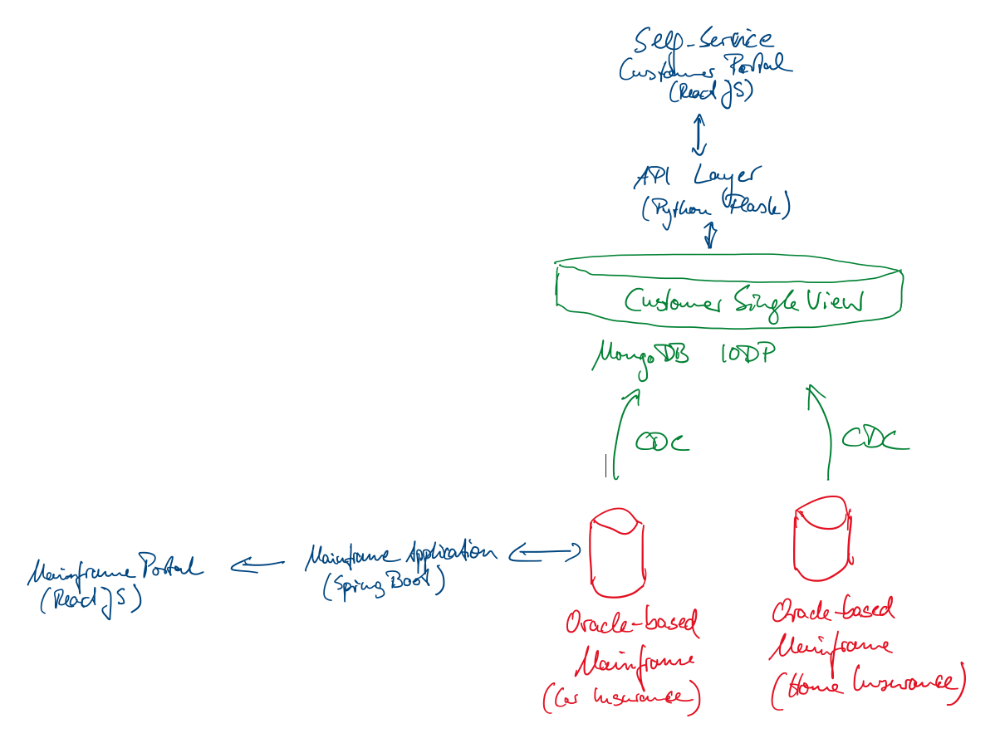
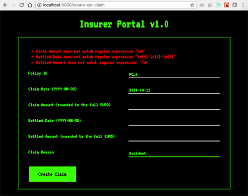
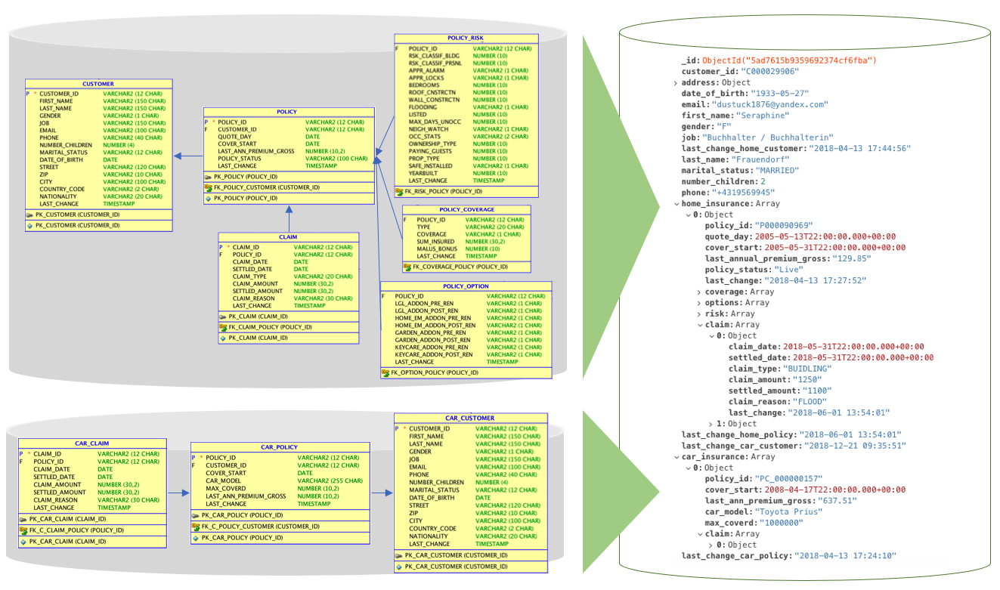

# MongoDB Demo: How to create a Single View of Customer in order Modernize Legacy Sytems, Mainframe Offloading and creating a Microservices Architecture

MongoDB is used by many large organizations to build mission-critical applications - lowering TCO, increasing developer productivity, de-risking development phases and therefore enabling companies to leverage data and technology for competitive advantage.

This project demonstrates how to create a Single of Customer based on an example in the insurance sector. A large-scale example of unifying more than 100 million individual customers is [MetLife](https://www.mongodb.com/customers/metlife): a working prototype has been built in just two weeks, three months later the project has been in production. This demonstration explains three major use cases:

* **Mainframe Offloading:** Release legacy mainframes from MIPS intensive workloads by offloading data and processes to a modern scalable data layer allowing you to reduce cost and enable new use cases demanded by business.
* **Single View of your business:** Centralize, organize and present your business relevant information from various sources and channels to serve the business demands like 360 customer view, Single source of Risk or centralized governance.
* **Legacy Modernization:** Address the range of new business requirements and modernize in an agile, highly efficient, scalable & timely manner.

## Demo Overview

The demo is based on example data that is publicly available. Home insurance data is taken from [Kaggle: 2007-2012 polices of a Home Insurance company](https://www.kaggle.com/ycanario/home-insurance). Car insurance data is based on some claims provided by [EmcienScan](http://www.scan-support.com/help/sample-data-sets). The direct download is also available: [Automobile Insurance claims including location, policy type and claim amount](http://dyzz9obi78pm5.cloudfront.net/app/image/id/560ec66d32131c9409f2ba54/n/Auto_Insurance_Claims_Sample.csv). Some slight modifications have been performed in order to provide a more complex relational structure and showcase some real-world challenges.

The following picture outlines the scenario: Insurance data is spread in two different legacy applications split up into car and home insurances (potentially mainframes, files, or other database systems). 



For the car insurances, there is a legacy application available to list customers and to create new insurance policies as well as claims.



A single view of customer aggregating both types of insurance policies and claims into one document per customer is built up in MongoDB. Two CDC processes are in place to update the data in MongoDB as soon as a change is performed in the underlying legacy database systems. We leverage the embedding pattern here, there are several other [Schema Design Patterns](https://www.mongodb.com/blog/post/building-with-patterns-a-summary) that can be used in such projects. We also make use of polymorph documents, i.e. documents can be of different shapes wihtin one collection. This is the case, if only type of insurance policy exists as well as if there are multiple policies of each types with/without claims.



The customers are provided with a self-service portal that they can use in their web browser. The API layer ensures that the same RESTful endpoints can be used for any additional application, e.g. a mobile app.

# Deployment

## Prerequisites ##

* A running instance of MongoDB OpsManager (tested with version 4.0.x) that is publicly accessible, e.g. installed via the tutorial https://docs.opsmanager.mongodb.com/current/tutorial/install-simple-test-deployment/
* As an alternative: A login to MongoDB Cloud Manager which is a hosted version of the OpsManager available at https://www.mongodb.com/cloud/cloud-manager (offering a free trial for 30 days)
* Please note the the Enterprise Toolings (like OpsManager, Kubernetes Operator) require a license when you use them in production. Nevertheless, for the purpose of testing and development these tools can be used without limitations (please double-check the evaluation license agreement at installation time of OpsManager)

## Automated Script - GCP

As the demo requires multiple resources, Kubernetes is a good way to deploy the demo and provide a runtime for all involved components.

### Prerequisites ###

* Tested on GKE cluster with the following specification: Kubernetes 1.12.8-gke.10; 3 Nodes (n1-standard-2 - 2 vCPUs, 7.5 GB RAM)

### Execute Deployment ###

Please run `deployment_kubernetes_gcp.sh` to automatically deploy into an existing GKE cluster. It takes the following parameters:
```
Usage: ./deployment_kubernetes_gcp.sh 
  -p project-name 
  -z compute-zone
  -a Account, e.g. gcpuser@gmail.com
  -p Project name in GCP, e.g. ckurze-k8s-operator-123456
  -z Compute zone where the k8s cluster is deployed, e.g. europe-west3-a
  -n Name of the k8s cluster, e.g. mdb-demo-cluster
  -b Base URL of OpsManager, e.g. http://ec2-111-222-333-444.eu-central-1.compute.amazonaws.com:8080
  -u User in OpsManager, e.g. username@mongodb.com
  -k API Key for RESTful access to OpsManager API, e.g. 6cdeeb2c-8815-aabb-ccdd-c19921e22d4a
  -o Organisation ID in OpsManager, e.g. aaaabbbbcc6d0c62773330ed
  -j Project name to be created in OpsManager, e.g. SingleViewDemo
```

The following call provides an example:
```
./deployment_kubernetes_gcp.sh -a gcpuser@gmail.com -p ckurze-k8s-operator-123456 -z europe-west3-a -n mdb-demo-cluster -b http://ec2-111-222-333-444.eu-central-1.compute.amazonaws.com:8080 -u username@mongodb.com -k 6cdeeb2c-8815-aabb-ccdd-c19921e22d4a -o aaaabbbbcc6d0c62773330ed -j SingleViewDemo
```

# TODO #

**Several enhancements can be performed:**
* Not just use Oracle, but other databases, too (e.g. PostgreSQL)
* Integrate new kinds of data, e.g. IoT - the user behaviour of drivers that get a dynmaic insurance premium based on their behaviour

**From a technical perspective:**
* Deployment into Kubernetes Cluster uses IP adresses for the pods of the ReplicaSets. As of the time of the writing (Aug 2019), support for external access is only available for Sharded Clusters. To reduce the complexity, this approach has not been taken. Future versions of MongoDB will support access to ReplicaSets in Kubernetes via the regular drivers, incl. the handling of different external and internal IP addresses.

**In order to ease deployment and leverage additional features, Atlas can be used:**
* Use a MongoDB Atlas cluster instead of a cluster in Kubernetes
* MongoDB Charts for visualization
* Stitch for hosting of insurance portal

# Authors

This demo is a joint effort of Christian Kurze, Sven Mentl, Sani Chabi-Yo, Felix Reichenbach and Sergi Vives.
